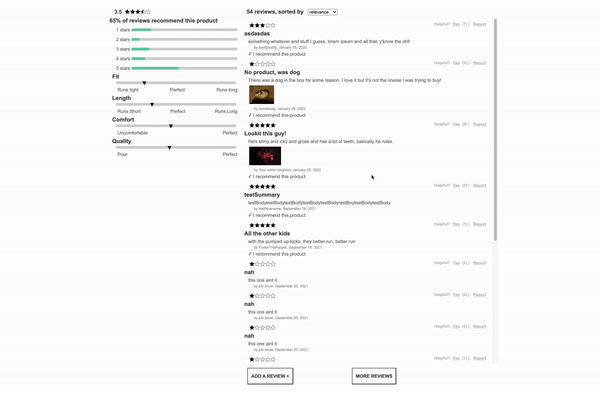

//header image

# Hack Reactor Front End Capstone

### Table of Contents
1. [Introduction](#introduction)
2. [Demo](#demo)
3. [Technologies](#technologies)
4. [Local Setup](#local-setup)
5. [Contributors](#contributors)

---

### Introduction
An e-commerce application produced during a 2-week project at Hack Reactor.

### Demo
//insert gifs here

### Related Items and Comparison

Related Products displays product cards of similiar items that may interest the user. This component includes:
* Scrollable list of product cards
* Scrollable preview images with each product cards
* A feature comparison table
* Conditionally rendered scroll buttons at either end of the carousel

The Outfit allows users to save and track individual products based on their interest. This component includes:
* Add to Outfit card which adds the current product to your Outfit list
* A delete card icon that removes the product from the list
* Upon refresh of the application, your Outfit list persists
### Reviews

### Technologies

- Axios : version 0.24.0
- Express : version 4.17.2
- React : version 17.0.2
- Styled Components : version 5.3.3
- Babel : version 6.23.0
- Webpack : version 5.65.0

### Local Setup

1. `git clone https://github.com/Team-Quartz/Front-End-Capstone.git`
2. `npm install`
3. `npm run webp`
4. `npm start`

### Contributors

- Liam Richardson | [LinkedIn](https://www.linkedin.com/in/richardson-liam/) | [GitHub](https://github.com/CptOblivion)
- Javier Tamez  | [LinkedIn](https://www.linkedin.com/in/javier-tamez/) | [GitHub](https://github.com/ProwlingLynx)
- Matthew Raquepo | [LinkedIn](https://www.linkedin.com/in/matthew-raquepo/) | [GitHub](https://github.com/maraquepo)
- Himmat Khalsa | [LinkedIn](https://www.linkedin.com/in/himmatkhalsa/) | [GitHub](https://github.com/thehimmat)
